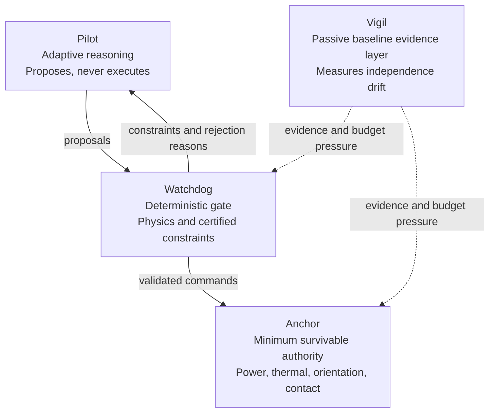

# CERBERUS Runtime Assurance

## The Fourth Guarantee: Independence as a Runtime Quantity

> **Intelligence is not safety.**  
> **Layering is not independence.**  
> **Independence is not permanent.**

CERBERUS is a research architecture for autonomous-system runtime assurance. It treats the failure-mode independence of its assurance layers as a perishable quantity that can be modeled, monitored, challenged, budgeted, and used to constrain authority.

## Release status

This repository is a **v3.4 release candidate and research prototype**. It is not flight-certified software, not a completed safety case, and not a claim of operational readiness.

The strongest reviewer-safe novelty hypothesis is architectural: a targeted primary-source review located no exact match for the complete loop in which the pessimistic upper bound of measured inter-layer failure-mode overlap becomes a controlled runtime resource - define it, monitor its drift, adversarially challenge omissions, budget authority against it, demote immediately, and restore only through fresh evidence.

## Architecture



- **Pilot** - adaptive reasoning and proposal generation; never directly executes.
- **Watchdog** - deterministic gate against physics invariants, hard envelopes, and certified constraints.
- **Anchor** - minimal mission-survivable authority for power, thermal, orientation, authenticated contact, and bounded recovery.
- **Vigil** - non-authoritative evidence layer whose load-bearing baseline is passive conditioned-residual monitoring.

Shared information is allowed. Shared cognition and shared authority failure modes are not.

## Start here

- [CERBERUS v3.4 reviewer-hardened paper](docs/CERBERUS_v3.4_Release_Candidate.md)
- [CERBERUS v3.3 formatted paper - PDF](docs/CERBERUS_v3.3_Release_Candidate.pdf)
- [CERBERUS v3.3 editable paper - DOCX](docs/CERBERUS_v3.3_Release_Candidate.docx)
- [Anchor Reference Specification](docs/CERBERUS_Anchor_Reference_Specification_v1.docx)
- [Adversarial Casebook](docs/CERBERUS_Adversarial_Casebook_v1.docx)
- [Interactive Vigil Lab](vigil-lab/index.html)
- [Novelty and primary-reference workbook](evidence/CERBERUS_Novelty_and_Reference_Matrix_v3.3.xlsx)
- [Dedicated Vigil pipeline-verification experiment](https://github.com/k766807/cerberus-vigil-experiment)
- [Implementation-status boundary](evidence/implementation_status.json)

## What changed in v3.4

- Reframed the synthetic result as a **matched-model pipeline-verification test**, not operational detector validation.
- Named the tautology risk explicitly: perfect separation is expected when the detector matches the generator.
- Clarified probabilistic FCOI as the share of total pair failure exposure attributable to shared-root joint failure.
- Required reporting of both marginal failure probabilities, the shared-root numerator, the union denominator, and the final ratio.
- Added a marginal-health promotion guard so worsening single-layer reliability cannot manufacture authority by lowering the ratio.
- Made passive conditioned-residual monitoring the load-bearing Vigil baseline.
- Reclassified sentinel injection as an optional, disabled-by-default diagnostic extension with no safety-case credit until independently validated.

## Matched-model pipeline verification

The maintained implementation, tests, committed reference outputs, and CI reproduction workflow live in the dedicated [`cerberus-vigil-experiment`](https://github.com/k766807/cerberus-vigil-experiment) repository.

Fixed results from the supplied matched synthetic model:

- Nominal sustained-alarm runs: **0 / 200**
- Coupling detections: **200 / 200**
- Median detection sample: **1061.5**
- Median lead before symptom: **238.5 samples**
- 10th-90th percentile lead: **160.9-319.6 samples**

> Perfect separation is expected in this matched-model setting. These numbers verify pipeline wiring, fixed-seed reproducibility, and conservative-bound behavior under known ground truth. They are not estimates of flight performance, realistic detection difficulty, robustness to model mismatch, full probabilistic FCOI, transfer entropy, sentinel safety, spacecraft FDIR, or flight authority logic.

```bash
git clone https://github.com/k766807/cerberus-vigil-experiment.git
cd cerberus-vigil-experiment
python -m pip install -e ".[dev]"
pytest
python run_experiment.py
```

## Evidence boundary

### Implemented research artifacts

- Browser Vigil Lab demonstrator
- Matched-model synthetic pipeline-verification experiment
- Adversarial Casebook
- Anchor Reference Specification
- Illustrative A3-A0 authority-state transitions

### Specified but not implemented

- Exact structural FCOI cut-set engine
- Probabilistic FCOI estimator
- Integrated Pilot shadow-mode red team
- Authenticated expiring ground-recovery command stack

### Proposed or optional

- Conditional transfer entropy extension
- Optional channel-specific sentinel interrogation
- Graph-external empirical witness
- Three-layer conservative reliability proof
- Flight or hardware-in-the-loop validation

## Repository layout

```text
├── docs/              paper, specifications, casebook, diagrams
├── evidence/          novelty matrix, reference records, status boundary
├── experiment/        archived v3.3 experiment snapshot
├── vigil-lab/         interactive browser demonstrator
├── verification/      traceability material
└── tools/             document-generation utilities
```

## Licensing and disclosure

This repository currently carries an [MIT License](LICENSE). Review that license before reuse or redistribution. Public availability and software licensing do not constitute a patentability opinion or operational certification.

## Author

**Emily Echterhoff**  
Project site: `cerberus-jq99.onrender.com`
