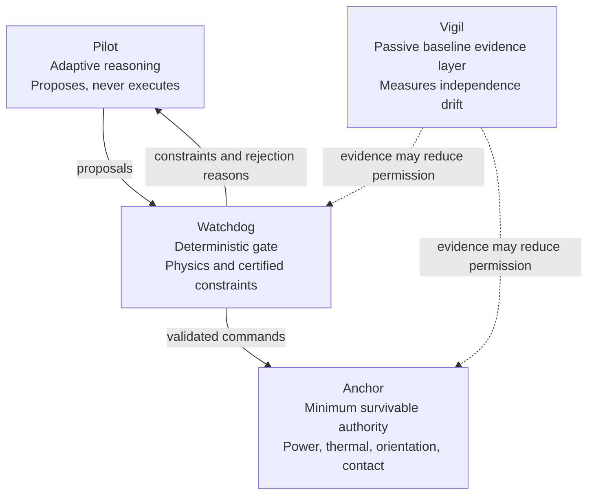

# CERBERUS Runtime Assurance

## The Fourth Guarantee: Independence as a Runtime Quantity

> **Intelligence is not safety.**  
> **Layering is not independence.**  
> **Independence is not permanent.**

CERBERUS is a research architecture for autonomous-system runtime assurance. It treats the failure-mode independence of its assurance layers as a **perishable runtime quantity** that can be modeled, monitored, challenged, budgeted, and used to constrain authority.

This README contains an accessible version of most of the v3.5 manuscript so the central argument, equations, architecture, evidence boundaries, and research plan can be read directly from the repository front page.

## Contents

- [One-minute explanation](#one-minute-explanation)
- [Release status](#release-status)
- [Abstract](#abstract)
- [Why CERBERUS exists](#why-cerberus-exists)
- [Bounded contributions](#bounded-contributions)
- [Research positioning](#research-positioning)
- [Architecture](#architecture)
- [Failure-Cause Overlap Index](#failure-cause-overlap-index)
- [Vigil evidence hierarchy](#vigil-evidence-hierarchy)
- [Independence budget and authority law](#independence-budget-and-authority-law)
- [Anchor and bounded recovery](#anchor-and-bounded-recovery)
- [Matched-model pipeline verification](#matched-model-pipeline-verification)
- [Threats to validity and open problems](#threats-to-validity-and-open-problems)
- [Implementation boundary](#implementation-boundary)
- [Research program](#research-program)
- [Start here](#start-here)
- [Repository layout](#repository-layout)
- [Licensing, disclosure, and authorship](#licensing-disclosure-and-authorship)

## One-minute explanation

Layered safety architectures usually assume that their safeguards fail differently. CERBERUS asks a harder question:

> **Does the trusted layering remain independent over mission life?**

CERBERUS separates four functions:

1. **Pilot** proposes adaptive plans but cannot execute them.
2. **Watchdog** deterministically checks proposals against physics and certified constraints.
3. **Anchor** preserves only the minimum survivable action set.
4. **Vigil** passively estimates whether the layers are beginning to fail for the same reasons.

When pessimistic evidence of shared failure causes rises, CERBERUS reduces the system's autonomy. Authority can fall immediately but can return only through fresh evidence, hysteresis, dwell time, and marginal-health checks.

The central architectural loop is:

> **define independence → measure drift → challenge omissions → budget authority → demote quickly → restore slowly**

## Release status

This repository contains the **v3.5 arXiv submission manuscript and research prototype**. It is:

- not flight-certified software;
- not a completed safety case;
- not a claim of operational readiness;
- not a validated spacecraft fault-detection system;
- not a patentability opinion.

The strongest reviewer-safe novelty hypothesis is architectural: a targeted primary-source review located no exact match for the complete loop in which the pessimistic upper bound of measured inter-layer failure-mode overlap becomes a controlled runtime resource.

## Abstract

Layered runtime assurance architectures rely on an assumption that is often argued at design time and then treated as permanent: the assurance layers will not fail for the same reasons.

CERBERUS proposes treating inter-layer failure-mode independence as a perishable runtime quantity. The architecture combines:

1. structural and probabilistic forms of a proposed **Failure-Cause Overlap Index (FCOI)**;
2. a non-authoritative **Vigil** whose load-bearing baseline is passive, conditioned, baseline-referenced residual monitoring;
3. a shadow-mode red-team process whose discoveries may only reduce confidence; and
4. an authority budget that contracts against pessimistic overlap evidence and restores authority only through fresh evidence, hysteresis, dwell time, and marginal-health checks.

A minimal **Anchor** preserves a survivable authority floor and prevents ground recovery from becoming an override channel. Sentinel injection is retained only as an optional diagnostic extension and receives no safety-case credit without an independent channel-specific safety case.

A fixed-seed matched-model experiment verifies that the evidence-to-authority pipeline is correctly wired and monotonic under known ground truth. Its perfect separation is explicitly **not** presented as operational detector validation.

The candidate contribution is architectural: to make the independence of the guardians **observable, challengeable, budgetable, and unable to flatter itself into authority**.

**Keywords:** runtime assurance; autonomous systems; common-cause failure; software diversity; spacecraft autonomy; dynamic assurance; FCOI.

## Why CERBERUS exists

Runtime assurance permits a high-performance but insufficiently trusted controller to operate while a simpler assurance mechanism filters, replaces, or constrains unsafe actions. Simplex and later runtime-assurance systems establish that a high-performance component can be supervised by a simpler trusted mechanism.

But multiple layers do not automatically establish independence.

Nominally diverse implementations may still fail on the same:

- difficult inputs;
- specifications;
- latent assumptions;
- environmental conditions;
- power or communication dependencies;
- maintenance errors;
- model omissions.

Common-cause-failure practice reaches the same conclusion from a reliability perspective: redundancy remains vulnerable when safeguards share causes.

CERBERUS therefore separates two claims:

> **Layering is a structural fact. Independence is an evidence claim that can decay.**

The system measures model-relative overlap, monitors evidence of drift, challenges omissions, and binds operational authority to conservative evidence. It does not claim that FCOI directly observes causality, that a causal graph is complete, or that the present prototype is flight-ready.

## Bounded contributions

The manuscript makes five bounded contributions:

1. **Failure-cause overlap formalization**  
   Structural and probabilistic forms of FCOI, including uncertainty direction and non-estimable cases.

2. **Evidence hierarchy**  
   Passive conditioned-residual monitoring is baseline; active sentinel interrogation is optional.

3. **Independence budget and asymmetric authority law**  
   Immediate demotion, slow promotion, and a marginal-health promotion guard.

4. **Survivable Anchor and bounded recovery**  
   Ground is treated as a possible failure cause rather than an oracle.

5. **Reproducible pipeline verification**  
   A matched-model experiment verifies wiring, fixed-seed reproducibility, and conservative monotonic behavior without claiming realistic detection performance.

## Research positioning

CERBERUS does not replace runtime assurance, common-cause-failure analysis, dynamic assurance, active interrogation, or switched-system control. It links them around a narrower question: whether the assurance architecture itself retains the independence on which layered protection relies.

| Research tradition | Established capability | CERBERUS-specific question |
|---|---|---|
| Simplex / runtime assurance | Filters or replaces unsafe actions from a less-trusted controller | Does the trusted layering remain independent over mission life? |
| Software diversity / common-cause failure | Models coincident and shared-cause failures | Can overlap evidence become a runtime authority constraint? |
| Runtime risk / dynamic assurance | Updates risk or assurance evidence as context changes | Can pessimistic independence evidence directly contract autonomy? |
| Dynamic watermarking | Actively probes channels for hidden coupling or attack | Can probing be optional, bounded, and unable to create authority? |
| Switched systems | Uses hysteresis and dwell time to stabilize switching | Can restoration carry a higher burden of proof than demotion? |

## Architecture



Information may be shared, but execution authority and failure mechanisms remain deliberately separated.

### Pilot

The Pilot performs adaptive reasoning, planning, and hypothesis generation.

It may:

- inspect deterministic constraints;
- pre-shape proposals;
- search for missing shared pathways in bounded shadow mode.

It may not:

- execute commands;
- relax constraints;
- write assurance evidence;
- promote authority.

### Watchdog

The Watchdog is a deterministic gate. It checks proposals against:

- physics invariants;
- hard envelopes;
- certified rules;
- mission-specific constraints.

Its value is not greater intelligence. Its value is a **different and auditable failure surface**.

### Anchor

The Anchor owns only the minimum mission-survivable action set:

- power-positive attitude;
- thermal survival;
- bounded orientation;
- authenticated contact;
- diagnostic beaconing;
- bounded fault isolation;
- an expiring diagnostic-recovery window.

Its invariants are not overridable by Pilot, Watchdog, Vigil, or ground command.

### Vigil

The Vigil estimates whether the layers remain failure-mode independent.

It has:

- no actuator path;
- no authority to certify independence;
- no authority to promote autonomy;
- no authority to execute commands.

Its baseline is passive monitoring. Its evidence may reduce permission or declare evidence unknown, but cannot increase permission by itself.

> **Evidence may reduce permission. It cannot execute, certify independence, or promote authority.**

## Failure-Cause Overlap Index

### Failure classes and causal model

Let

```math
I = \{P, W, A\}
```

represent Pilot, Watchdog, and Anchor. Let $K$ be a set of consequence-relevant failure classes, such as:

- unsafe trajectory acceptance;
- loss of safe attitude;
- violation of a power survival floor;
- loss of authenticated recovery.

For layer $i$, failure class $k$, and exposure interval $\Delta$, let $F_{i,k}(\Delta)$ denote failure of layer $i$ to perform its stated safety function.

For each class $k$, let

```math
G_k = (V_k, E_k)
```

be a reviewed directed causal graph containing root causes, measured environmental variables, propagation mechanisms, and terminal layer failures.

### Structural FCOI

Let $M_{i,k}$ be the family of minimal cut sets sufficient to produce $F_{i,k}$. The exact-match structural overlap between layers $i$ and $j$ is

```math
\mathrm{FCOI}^{S}_{ij,k} = \frac{|M_{i,k} \cap M_{j,k}|}{|M_{i,k} \cup M_{j,k}|}.
```

This value is defined only when the union is nonempty.

If both cut-set families are empty, the result is **not estimable**, not zero.

Exact matching is transparent but can understate near-match cut sets that share most root causes. Structural FCOI is therefore a screening quantity and should be accompanied by a near-match census or weighted-incidence refinement.

### Probabilistic FCOI

Let $C_{ij,k}(\Delta)$ denote the event that both $F_{i,k}$ and $F_{j,k}$ occur through at least one shared modeled root cause during $\Delta$. Let $D_t$ denote the evidence available at time $t$.

Define

```math
\mathrm{FCOI}^{P}_{ij,k}(t;\Delta) = \frac{P(C_{ij,k}(\Delta)\mid D_t)}{P(F_{i,k}(\Delta)\cup F_{j,k}(\Delta)\mid D_t)}.
```

Because the shared-root joint-failure event is a subset of the union event, this quantity can be read as:

> the probability that a pair failure is attributable to a shared modeled root cause, conditioned on at least one layer failing.

The union denominator is intentional. The metric describes the **fraction of total pair failure exposure attributable to shared-root joint failure**.

It is not a reliability-invariant dependence coefficient. Because the denominator changes with marginal layer failure probabilities, every operational report should separately include:

- the marginal failure probability of layer $i$;
- the marginal failure probability of layer $j$;
- the shared-root numerator;
- the union denominator;
- the FCOI estimate and uncertainty interval.

### Pessimistic operational value

The runtime value used for authority decisions is the upper defensible bound:

```math
\mathrm{FCOI}_{ij,k}(t) = \mathrm{UCB}_{1-\alpha}\!\left(\mathrm{FCOI}^{P}_{ij,k}(t)\right).
```

Higher overlap means less independence, so a lower confidence bound would flatter the system.

Define a triple-layer quantity analogously and let

```math
O_k(t) = \max\left\{\mathrm{FCOI}_{PW,k},\mathrm{FCOI}_{PA,k},\mathrm{FCOI}_{WA,k},\mathrm{FCOI}_{PWA,k}\right\}.
```

The maximum is deliberately conservative and auditable.

If evidence is stale, internally inconsistent, invalid, or not estimable, the relevant class is treated as **unknown rather than independent**.

## Vigil evidence hierarchy

### 1. Passive conditioned-residual monitoring

Shared environmental inputs can create benign correlation. Vigil therefore conditions on measured common stimuli and monitors departures from commissioning baselines rather than raw correlation.

The present prototype uses:

- a simple linear conditioning model;
- rolling residual correlation;
- a one-sided Fisher upper confidence bound;
- a persistence rule.

Simpler auditable statistics and sequential detectors are intentionally preferred before data-hungry information-theoretic methods.

A passive alarm does not by itself identify a root cause or distinguish harmful coupling from an unmeasured benign stimulus. Its valid action is conservative:

- reduce the independence budget;
- preserve the evidence trace;
- request diagnosis.

> **Ambiguity cannot create permission.**

### 2. Optional sentinel interrogation

Active interrogation can test whether a perturbation leaks into a nominally independent channel. But injecting a live system creates its own risk.

In CERBERUS:

- every channel is passive-only by default;
- sentinel interrogation is optional;
- sentinel evidence receives no baseline safety-case credit;
- sentinel evidence cannot increase the budget;
- sentinel evidence cannot promote authority;
- sentinel evidence is not required for demotion.

A channel may become injectable only after an independent, channel-specific hardware-in-the-loop safety case establishes:

- amplitude and duration caps;
- maneuver and safing exclusions;
- automatic removal;
- state-estimation protection;
- actuation-deadband protection;
- detection-power evidence;
- no unacceptable injection-attributable effects.

### 3. Pilot red team and graph-external witness

During bounded shadow-mode windows, the Pilot may propose missing shared pathways and test them against replay, simulation, or recorded telemetry.

A monotonicity ratchet permits discoveries only to:

- reduce confidence;
- narrow authority;
- trigger review.

The Pilot can find a hole in the fence. It cannot declare the fence sound.

All graph-based methods share an ontology risk: an omitted mechanism can evade the FCOI graph, the conditioning model, and the red-team search boundary at once.

CERBERUS therefore proposes a separately implemented, model-light empirical witness using different representations and assumptions. It may only reduce confidence or declare inconsistency. It cannot certify independence or promote authority.

This witness remains proposed work.

## Independence budget and authority law

For each failure class $k$, design review establishes:

- a maximum acceptable overlap $\theta_k$;
- a certified baseline upper bound $O_{k,0} < \theta_k$.

Define the overlap margin

```math
m_k(t) = \theta_k - O_k(t),
```

the class budget

```math
b_k(t) = \operatorname{clip}\!\left(\frac{\theta_k - O_k(t)}{\theta_k - O_{k,0}},0,1\right),
```

and the system budget

```math
B(t) = \min_{k\in K} b_k(t).
```

If evidence for class $k$ is stale, invalid, inconsistent, or non-estimable, then

```math
b_k(t) = 0
```

until valid evidence is restored.

Catastrophic classes cannot be averaged away by healthier low-consequence classes.

### Marginal-health promotion guard

A ratio can appear to improve because:

1. the shared-cause numerator falls; or
2. independent single-layer failure exposure grows.

The second case does not justify more authority.

Let $H_k(t)$ be true only when the certified upper bounds on the marginal failure probabilities of every relevant layer are:

- below class-specific limits; and
- non-worsening over the promotion evidence window.

Promotion requires both adequate $B(t)$ and $H_k(t)=1$ for every promotion-critical class.

Demotion may occur from:

- overlap deterioration;
- marginal-health deterioration;
- invalid evidence.

### Authority states

| State | Pilot role | Permitted system behavior |
|---|---|---|
| **A3** | Full proposal envelope | Watchdog accepts only certified-safe proposals; full negotiated mission authority |
| **A2** | Restricted proposals | Reduced magnitudes, narrower plans, stronger cross-channel agreement |
| **A1** | Advisory only | Watchdog-directed operation; Pilot may analyze but not control |
| **A0** | No mission authority | Anchor maintains the minimum survivable action set and contact posture |

### Asymmetric switching discipline

- Demotion is immediate and may skip states.
- Promotion is sequential, one state at a time.
- Promotion requires a higher threshold than demotion.
- Promotion requires continuous valid evidence for a dwell period.
- Unknown evidence cannot produce promotion.
- Hysteresis reduces chattering.

Restoration therefore carries a higher burden of proof than contraction.

## Anchor and bounded recovery

### A0 must remain survivable

Fail-conservative behavior is not sufficient if it leaves a vehicle:

- silent;
- tumbling;
- thermally unstable;
- power-negative;
- unable to authenticate ground contact.

The Anchor therefore preserves:

- power-positive attitude;
- thermal survival;
- bounded orientation;
- authenticated command reception;
- a diagnostic beacon;
- bounded isolation;
- an expiring diagnostic-recovery window.

### Ground is a possible failure cause

Ground command cannot be modeled as an omniscient override. A two-party authenticated ground directive may request:

- diagnostics;
- bounded re-baselining;
- re-arming of the promotion law.

It cannot:

- write $B(t)$;
- assign an authority state;
- waive dwell evidence;
- override Anchor invariants.

> **Ground can reopen the evidentiary path. It cannot walk the vehicle up it.**

## Matched-model pipeline verification

The maintained implementation, tests, committed reference outputs, and CI reproduction workflow live in the dedicated [`cerberus-vigil-experiment`](https://github.com/emilyecht/cerberus-vigil-experiment) repository.

### Purpose

The experiment asks whether the implemented evidence-to-authority pipeline behaves correctly under known ground truth.

Two synthetic channels share a measured environment. A latent process is deliberately coupled into both channels after a known onset. Vigil:

1. estimates environmental response during commissioning;
2. monitors residual correlation;
3. converts it to a one-sided upper confidence bound;
4. requires persistent threshold exceedance;
5. maps adverse evidence to illustrative authority contraction.

> **Perfect separation is expected when the detector's model matches the data generator.**

The experiment tests pipeline correctness, reproducibility, and conservative-bound behavior—not detection difficulty.

### Fixed protocol

- 1,800 samples per run;
- commissioning interval ending at sample 500;
- coupling onset at sample 700;
- predefined behavioral symptom at sample 1,300;
- 120-sample rolling window;
- 100 independent nominal calibration runs;
- separate ensembles of 200 nominal and 200 coupling evaluation runs;
- alarm threshold set to the 95th percentile of the post-commissioning maximum upper-bound statistic across calibration runs;
- ten consecutive exceedances required;
- calibrated threshold: **0.458326**.

### Fixed results

| Metric | Result |
|---|---:|
| Nominal sustained-alarm runs | **0 / 200** |
| Two-sided 95% exact upper bound on nominal run-alarm rate | **1.83%** |
| Coupling detections | **200 / 200** |
| Two-sided 95% exact lower bound on coupling detection rate | **98.17%** |
| Median detection sample | **1061.5** |
| Median lead before defined symptom | **238.5 samples** |
| 10th–90th percentile lead | **160.9–319.6 samples** |
| Representative detection sample | **984** |

### Correct interpretation

The perfect observed separation verifies that the following are wired consistently in the supplied matched synthetic model:

- conditioning;
- calibration split;
- persistence rule;
- upper-bound computation;
- fixed-seed output generation;
- illustrative authority transitions.

It does **not** establish:

- zero false alarms;
- perfect operational detection;
- causal discovery;
- model-mismatch robustness;
- realistic telemetry performance;
- full probabilistic FCOI;
- sentinel safety;
- spacecraft fault-detection performance;
- flight authority validity.

The next experiments must intentionally break the match between detector and generator.

### Reproduce the experiment

```bash
git clone https://github.com/emilyecht/cerberus-vigil-experiment.git
cd cerberus-vigil-experiment
python -m pip install -e ".[dev]"
pytest
python run_experiment.py
```

## Threats to validity and open problems

### Model-relative causality

FCOI is only as complete as the causal ontology and evidence model. A graph-external witness may reduce self-reference but does not solve ontology incompleteness.

### Denominator sensitivity

Probabilistic FCOI is a failure-exposure composition ratio, not a pure dependence coefficient. Marginal probabilities and the shared-root numerator must be reported separately, and promotion must pass the marginal-health guard.

### Measurement confounding

Environmental conditioning can be wrong, stale, or itself degraded. Missing variables may create false coupling, while degrading sensors may hide real coupling.

### Availability attack surface

Conservative unknown handling can be exploited to force prolonged A0 operation. Availability metrics, bounded diagnostics, and recovery performance must therefore be evaluated beside safety.

### Sentinel consequence

Active interrogation perturbs a live system and is the highest-consequence, least-evidenced mechanism. It remains optional until independently validated.

### Three-layer reliability theory

Much conservative diverse-system theory is formulated for two channels. A defensible three-layer aggregation and reliability claim remains open.

### Novelty boundary

A targeted primary-source review through July 2026 did not identify an exact prior composition that turns pessimistic runtime independence evidence into the controlled resource linking:

- common-cause-failure analysis;
- passive monitoring;
- adversarial discovery;
- authority allocation;
- evidence-gated restoration.

This is a research-positioning statement, not an exhaustive search or patentability opinion.

## Implementation boundary

| Artifact or mechanism | Status | Evidence boundary |
|---|---|---|
| Vigil browser lab | Implemented explanatory prototype | Simplified proxy dynamics; not flight software |
| Matched-model experiment | Implemented and reproducible | Pipeline verification only; no realistic-difficulty claim |
| Adversarial Casebook | Implemented research artifact | Scenario library is not exhaustive or a certified FMEA/PRA |
| Anchor specification | Implemented specification artifact | No flight hardware or formally verified implementation |
| Structural FCOI engine | Specified, not implemented | Requires reviewed causal graphs and cut-set tooling |
| Probabilistic FCOI estimator | Specified, not implemented | Requires calibrated root-cause, propagation, and marginal-failure models |
| Sentinel interrogation | Optional, proposed | No safety-case credit without channel-specific HIL validation |
| Graph-external witness | Proposed | Algorithm and independence argument remain open |
| Flight / HIL validation | Future work | No certification, TRL, or operational-readiness claim |

## Research program

The next verification sequence is:

1. compare residual correlation against raw correlation, partial/rank correlation, CUSUM, Page–Hinkley, and simple ensembles using identical seed partitions;
2. introduce nonstationarity, missing and bursty telemetry, timestamp drift, maneuver transients, degrading environment sensors, and benign unmodeled stimuli;
3. pre-register thresholds and acceptance criteria before held-out evaluation;
4. implement a structural cut-set engine and test near-match weighting against reviewed examples;
5. build a graph-external witness with a separate representation and one-way authority effect;
6. evaluate authority chattering, time at level, recovery latency, and denial-of-availability behavior;
7. conduct channel-specific HIL testing before any active sentinel receives safety-case credit.

## Conclusion

CERBERUS begins from a simple constraint:

> **Intelligence is not safety.**

It separates layering from independence and treats independence as perishable.

- FCOI is explicitly model-relative.
- Operational authority burns against a pessimistic upper bound.
- Invalid evidence cannot create permission.
- Worsening marginal layer health cannot manufacture promotion through a favorable ratio.
- Demotion is immediate.
- Restoration is sequential and earned.
- Ground cannot bypass the mechanism.
- Passive evidence remains load-bearing.
- Active interrogation remains optional.

The present experiment proves one narrow but useful fact: under an explicit generator aligned with the detector, the evidence-to-authority pipeline executes reproducibly and moves conservatively in the intended direction.

The next scientific burden is not to repeat perfect separation, but to attack the pipeline with mismatch, degraded telemetry, alternative detectors, and realistic common-cause mechanisms.

The proposed architectural contribution is to make the independence of the guardians:

> **observable, challengeable, budgetable, and unable to flatter itself into authority.**

## Start here

- [CERBERUS v3.5 arXiv manuscript source](paper/arxiv/CERBERUS_v3.5_arXiv.tex)
- [arXiv source build notes](paper/arxiv/README.md)
- [CERBERUS v3.4 reviewer-hardened paper](docs/CERBERUS_v3.4_Release_Candidate.md)
- [Anchor Reference Specification](docs/CERBERUS_Anchor_Reference_Specification_v1.docx)
- [Adversarial Casebook](docs/CERBERUS_Adversarial_Casebook_v1.docx)
- [Interactive Vigil Lab](vigil-lab/index.html)
- [Novelty and primary-reference workbook](evidence/CERBERUS_Novelty_and_Reference_Matrix_v3.3.xlsx)
- [Dedicated Vigil pipeline-verification experiment](https://github.com/emilyecht/cerberus-vigil-experiment)
- [Implementation-status boundary](evidence/implementation_status.json)

The complete bibliography and citation details are maintained in the manuscript source and reference files under [`paper/arxiv/`](paper/arxiv/).

## Repository layout

```text
├── paper/arxiv/       submission-ready LaTeX source, references, and figure data
├── docs/              prior papers, specifications, casebook, diagrams
├── evidence/          novelty matrix, reference records, status boundary
├── experiment/        archived v3.3 experiment snapshot
├── vigil-lab/         interactive browser demonstrator
├── verification/      traceability material
└── tools/             document-generation utilities
```

## Licensing, disclosure, and authorship

### License

This repository currently carries an [MIT License](LICENSE). Review that license before reuse or redistribution. Public availability and software licensing do not constitute a patentability opinion, safety certification, or operational approval.

### Author responsibility statement

AI-based tools were used for editorial critique, literature organization, and code assistance. The named author is responsible for the manuscript, references, software, claims, and submission.

### Author

**Emily Echterhoff**  
Independent Researcher
