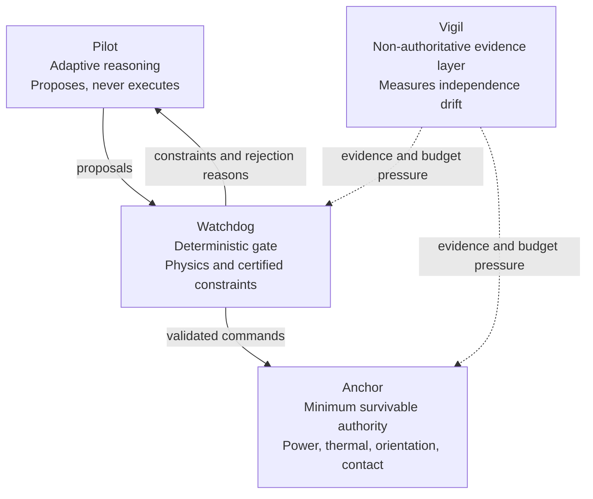

# CERBERUS Runtime Assurance

## The Fourth Guarantee: Independence as a Runtime Quantity

> **Intelligence is not safety.**  
> **Layering is not independence.**  
> **Independence is not permanent.**

CERBERUS is a research architecture for autonomous-system runtime assurance. It treats the failure-mode independence of its assurance layers as a perishable quantity that can be modeled, monitored, challenged, budgeted, and used to constrain authority.

## Release status

This repository is a **v3.3 release candidate and research prototype**. It is not flight-certified software, not a completed safety case, and not a claim of operational readiness.

The strongest reviewer-safe novelty hypothesis is architectural: a targeted primary-source review located no exact match for the complete loop in which the pessimistic upper bound of measured inter-layer failure-mode overlap becomes a controlled runtime resource—define it, monitor its drift, adversarially challenge omissions, budget authority against it, demote immediately, and restore only through fresh evidence.

## Architecture



- **Pilot** — adaptive reasoning and proposal generation; never directly executes.
- **Watchdog** — deterministic gate against physics invariants, hard envelopes, and certified constraints.
- **Anchor** — minimal mission-survivable authority for power, thermal, orientation, authenticated contact, and bounded recovery.
- **Vigil** — non-authoritative evidence layer that measures whether the other layers remain independent.

Shared information is allowed. Shared cognition and shared authority failure modes are not.

## Start here

- [CERBERUS v3.3 release-candidate paper](docs/CERBERUS_v3.3_Release_Candidate.pdf)
- [Editable paper source](docs/CERBERUS_v3.3_Release_Candidate.docx)
- [Anchor Reference Specification](docs/CERBERUS_Anchor_Reference_Specification_v1.docx)
- [Adversarial Casebook](docs/CERBERUS_Adversarial_Casebook_v1.docx)
- [Interactive Vigil Lab](vigil-lab/index.html)
- [Novelty and primary-reference workbook](evidence/CERBERUS_Novelty_and_Reference_Matrix_v3.3.xlsx)
- [Dedicated reproducible Vigil experiment](https://github.com/k766807/cerberus-vigil-experiment)
- [Implementation-status boundary](evidence/implementation_status.json)

## What changed in v3.3

- Corrected the remaining v3.2 editorial defects.
- Verified 37 retained references against primary publisher, agency, standards-body, official-report, or author-manuscript sources.
- Completed an 18-claim novelty matrix with closest prior art, confidence, and permitted claim language.
- Formalized structural and probabilistic FCOI, uncertainty bounds, class aggregation, normalized budget, and authority transitions.
- Added a fixed-seed reproducible synthetic Vigil experiment with machine-readable outputs.
- Separated implemented prototypes, implemented research artifacts, specifications, proposed mechanisms, open theory, and future validation.
- Added the shared-ontology limitation and proposed a graph-external empirical witness as future work.

## Reproducible experiment

The experiment tests one narrow proposition: after conditioning two synthetic channels on a measured common environment, an emerging latent shared pathway can be detected from residual dependence before a predefined behavioral-symptom time, and a conservative upper bound can drive illustrative authority contraction.

The maintained implementation, tests, committed reference outputs, and CI reproduction workflow live in the dedicated [`cerberus-vigil-experiment`](https://github.com/k766807/cerberus-vigil-experiment) repository.

Fixed results from the supplied synthetic model:

- Nominal false-alarm runs: **0 / 200**
- Coupling detections: **200 / 200**
- Median detection sample: **1061.5**
- Median lead before symptom: **238.5 samples**
- 10th–90th percentile lead: **160.9–319.6 samples**

These results are not estimates of flight performance and do not validate full probabilistic FCOI, transfer entropy, sentinel safety, spacecraft FDIR, or flight authority logic.

```bash
git clone https://github.com/k766807/cerberus-vigil-experiment.git
cd cerberus-vigil-experiment
python -m pip install -e ".[dev]"
pytest
python run_experiment.py
```

## Evidence boundary

### Implemented research artifacts

- Browser Vigil Lab demonstrator
- Synthetic independence-decay experiment
- Adversarial Casebook
- Anchor Reference Specification
- Illustrative A3–A0 authority-state transitions

### Specified but not implemented

- Exact structural FCOI cut-set engine
- Probabilistic FCOI estimator
- Integrated Pilot shadow-mode red team
- Authenticated expiring ground-recovery command stack

### Proposed or open

- Conditional transfer entropy extension
- Hardware-in-the-loop sentinel safety case
- Graph-external empirical witness
- Three-layer conservative reliability proof
- Flight or hardware-in-the-loop validation

## Repository layout

```text
├── docs/              paper, specifications, casebook, diagrams
├── evidence/          novelty matrix, reference records, status boundary
├── experiment/        archived v3.3 experiment snapshot
├── vigil-lab/         interactive browser demonstrator
├── verification/      traceability material
└── tools/             document-generation utilities
```

## Licensing and disclosure

No software or documentation license is selected in this release. Do not infer permission to use, modify, redistribute, or commercialize the contents from public availability alone. This is not a patentability opinion.

## Author

**Emily Echterhoff**  
Project site: `cerberus-jq99.onrender.com`
