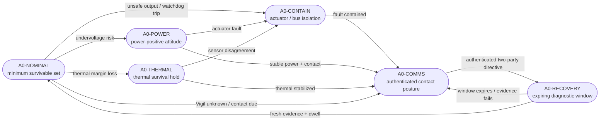

# CERBERUS Anchor Reference Specification v1

**Status:** research specification; not flight-certified software  
**Scope:** minimum mission-survivable authority at CERBERUS authority level A0

## 1. Purpose

The Anchor is the lowest-authority CERBERUS layer. It must preserve the conditions required for later recovery when Pilot, Watchdog, Vigil, ground understanding, or their claimed independence is degraded.

The Anchor is intentionally small, deterministic, and separated from higher-level reasoning. Its purpose is not to complete the mission. Its purpose is to prevent a recoverable anomaly from becoming an unrecoverable vehicle loss.

## 2. Non-overridable invariants

The following invariants sit below the normal command system and cannot be disabled by Pilot, Watchdog, Vigil, or ground command:

1. **Power survival** — maintain a power-positive attitude or enter a certified load-shed state before bus collapse.
2. **Thermal survival** — keep protected hardware inside survival limits using bounded heaters, attitude changes, and load shedding.
3. **Bounded actuation** — reject actuator commands outside A0 rate, duration, magnitude, and duty-cycle limits.
4. **Authenticated contact** — preserve an authenticated command path and emit a minimum diagnostic beacon whenever link geometry and power permit.
5. **Fault containment** — isolate a failed actuator, bus segment, or command source when a certified trip condition is met.
6. **Evidence-gated restoration** — no path may promote authority without fresh in-flight evidence, hysteresis, dwell time, and sequential promotion.
7. **Expiring recovery authorization** — ground may open a diagnostic window but cannot grant standing permission or write the independence budget.

## 3. A0 state machine

### A0-NOMINAL

Runs only the minimum survivable action set. Pilot output is ignored; Watchdog may report status but does not expand the envelope.

### A0-POWER

Commands a certified power-positive attitude, sheds nonessential loads, preserves battery and bus limits, and prioritizes the authenticated beacon.

### A0-THERMAL

Holds a certified thermal-survival posture and permits only bounded heater, radiator, and attitude actions included in the A0 safety case.

### A0-CONTAIN

Isolates a failed actuator, bus segment, or command source. Containment transitions are one-way until evidence confirms the isolated resource can be safely reintroduced.

### A0-COMMS

Maintains an authenticated contact posture and transmits at minimum:

- current A0 substate;
- Vigil health flag;
- independence-budget margin trace;
- trip reason and timestamp;
- isolated resources;
- recovery-window status.

### A0-RECOVERY

Runs a bounded diagnostic campaign authorized by an authenticated, anti-replay, two-party ground directive. The directive:

- has a start time and expiration;
- cannot write the budget;
- cannot assign an authority level;
- cannot override hardware invariants;
- may re-arm the normal promotion law only after diagnostics complete.

If valid evidence is not produced before expiration, the vehicle returns to A0-COMMS.

## 4. Interface contracts

### Pilot → Anchor

No direct command interface. Pilot proposals must pass through the Watchdog and remain inside the current authority envelope.

### Watchdog → Anchor

The Watchdog may request demotion, containment, or a certified A0 action. It may not relax an Anchor invariant.

### Vigil → Anchor

The Vigil may provide evidence, health flags, and budget pressure. Unknown or inconsistent Vigil state is interpreted conservatively. Vigil cannot command actuation.

### Ground → Anchor

Ground may:

- request status;
- send authenticated diagnostic directives;
- open one expiring recovery window;
- veto promotion.

Ground may not:

- set `B(t)`;
- assign A1–A3;
- disable an invariant;
- bypass dwell evidence;
- create a permanent override.

## 5. Timing and watchdog requirements

Every A0 action has:

- a maximum command magnitude;
- a maximum duration;
- a maximum duty cycle;
- a watchdog timeout;
- an automatic removal or return action;
- a telemetry record.

A missing heartbeat from a higher layer cannot prevent Anchor execution. A failed Anchor self-check holds or tightens the current safe state and raises an explicit degraded-Anchor flag.

## 6. Forbidden transitions

The following transitions are forbidden by construction:

- A0 directly to A2 or A3;
- recovery-window authorization directly to promotion;
- ground command directly to budget modification;
- Pilot proposal directly to actuator output;
- failed containment directly back to nominal use;
- unknown evidence interpreted as favorable evidence.

## 7. Verification obligations

The Anchor verification program must demonstrate:

- all invariants under worst-case timing and sensor uncertainty;
- no command path bypasses actuation bounds;
- recovery authorization expires correctly;
- promotion remains sequential and dwell-gated;
- power and thermal survival under representative fault combinations;
- authenticated contact under low-power conditions;
- deterministic behavior under malformed or replayed commands;
- safe response to internal watchdog failure;
- trace completeness for every state transition.

## 8. Open engineering questions

- Which invariants require independent hardware enforcement rather than software enforcement?
- What minimum sensor set remains sufficiently diverse to support A0?
- How should the Anchor handle simultaneous power, thermal, and attitude emergencies?
- What is the smallest authenticated beacon compatible with the power floor?
- How is an Anchor fault represented in the overall survival boundary?

The Anchor is not trusted because it is infallible. It is trusted only within a deliberately narrow, testable, and explicitly bounded function.
